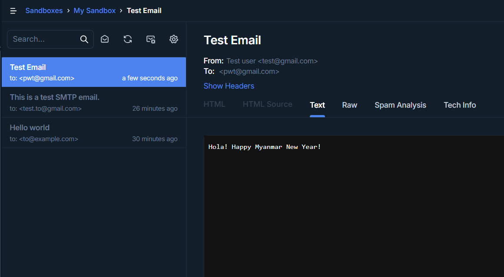

#Test Result

## Send Email

### Success

```
{
    "success": true,
    "message": "Email sent successfully"
}
```

### Failure

```
{
    "success": false,
    "message": "Failed to send email"
}
```

## Scalar API


## Mailtrap Sandbox


